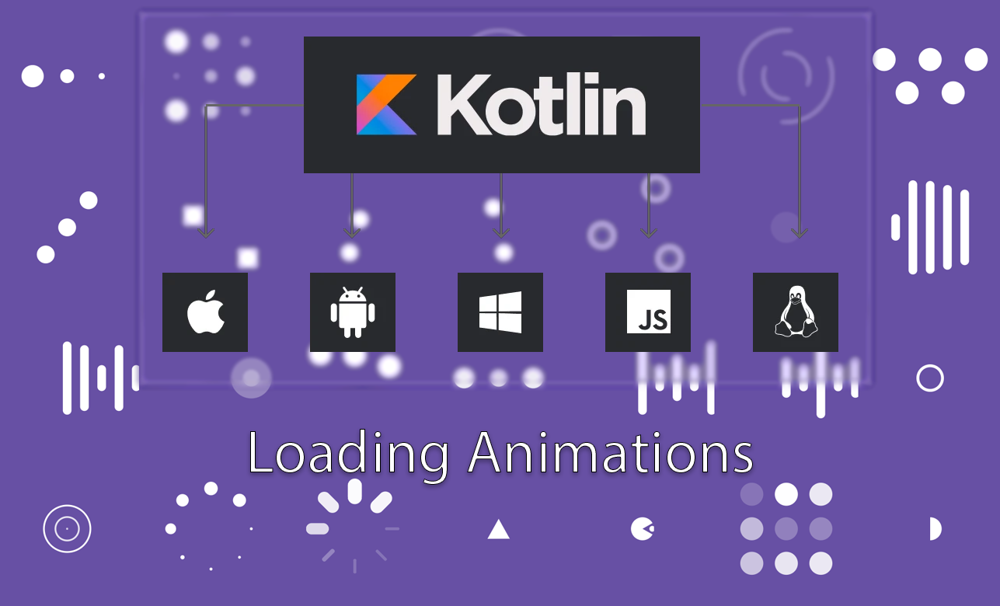
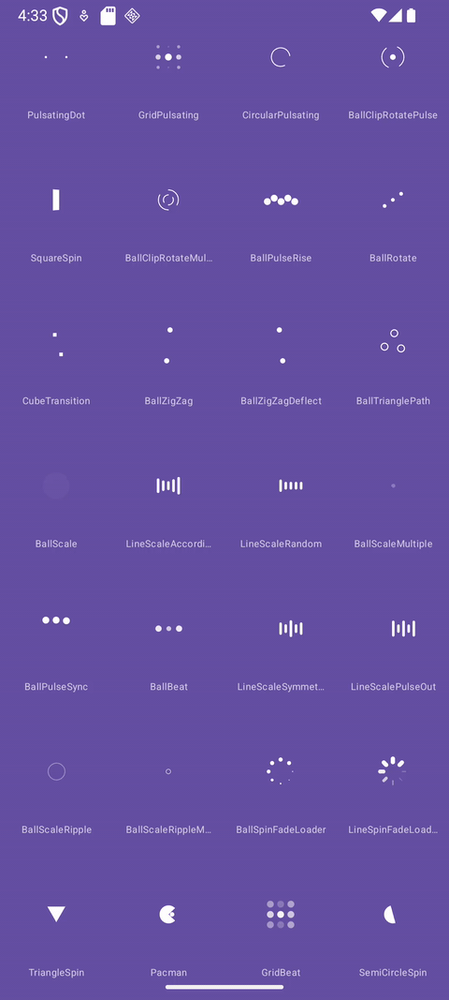

<p align="center">
  
</p>

[](https://jitpack.io/#akimaleo/kmp-loading-animations)

# KMP Loading Animation

A collection of beautiful, ready-to-use loading & spinner animations for
**Compose Multiplatform** — Android, iOS, Desktop (JVM), and Web.

Adapted from the famous
[AVLoadingIndicatorView](https://github.com/HarlonWang/AVLoadingIndicatorView)
and rebuilt from the ground up with Kotlin Multiplatform + Compose.

---

## Demo

<p align="center">
  
</p>


---

## Installation

### Step 1 — Add the JitPack repository

```kotlin
// settings.gradle.kts
dependencyResolutionManagement {
    repositories {
        maven { url = uri("https://jitpack.io") }
    }
}
```

### Step 2 — Add the dependency

```kotlin
// build.gradle.kts
dependencies {
    implementation("com.github.akimaleo:kmp-loading-animations:2.0.1")
}
```

### Step 3 — Use any indicator

```kotlin
@Composable
fun Greeting() {
    PacmanIndicator()
}
```

Every indicator exposes optional parameters for full customisation:

```kotlin
PacmanIndicator(
    color = Color.Black,
    ballDiameter = 60f,
    canvasSize = 60.dp,
    animationDuration = 1000
)
```

---

## Available Indicators

| # | Indicator | # | Indicator |
|---|-----------|---|-----------|
| 1 | `PulsatingDot` | 15 | `LineScaleIndicator` (random) |
| 2 | `GridIndicator` (pulsating) | 16 | `BallScaleMultipleIndicator` |
| 3 | `CircularPulsatingIndicator` | 17 | `BallPulseSyncIndicator` |
| 4 | `BallClipRotatePulseIndicator` | 18 | `BallBeatIndicator` |
| 5 | `SquareSpinIndicator` | 19 | `LineScaleIndicator` (symmetric) |
| 6 | `BallClipRotateMultipleIndicator` | 20 | `LineScaleIndicator` (pulse-out) |
| 7 | `BallPulseRiseIndicator` | 21 | `BallScaleRippleIndicator` |
| 8 | `BallRotateIndicator` | 22 | `BallScaleRippleMultipleIndicator` |
| 9 | `CubeTransitionIndicator` | 23 | `BallSpinFadeLoaderIndicator` |
| 10 | `BallZigZagIndicator` | 24 | `LineSpinFadeLoaderIndicator` |
| 11 | `BallZigZagDeflectIndicator` | 25 | `TriangleSpinIndicator` |
| 12 | `BallTrianglePathIndicator` | 26 | `PacmanIndicator` |
| 13 | `BallScaleIndicator` | 27 | `GridIndicator` (beating) |
| 14 | `LineScaleIndicator` (accordion) | 28 | `SemiCircleSpinIndicator` |

Additional indicators: `GridFadeDiagonal`, `GridFadeAntiDiagonal`,
`BallRespectivelyExitIndicator`, `TriangleShapeIndicator`,
`CircleShapeIndicator`.

---


## Targets

| Platform | Status |
|----------|--------|
| Android  | ✅ |
| iOS      | ✅ |
| Desktop (JVM) | ✅ |
| Web (JS) | ✅ |
| Web (Wasm) | ✅ |

---

## License

```
Copyright 2023 Mahboubeh Seyedpour

Licensed under the Apache License, Version 2.0 (the "License");
you may not use this file except in compliance with the License.
You may obtain a copy of the License at

    http://www.apache.org/licenses/LICENSE-2.0

Unless required by applicable law or agreed to in writing, software
distributed under the License is distributed on an "AS IS" BASIS,
WITHOUT WARRANTIES OR CONDITIONS OF ANY KIND, either express or implied.
See the License for the specific language governing permissions and
limitations under the License.
```
